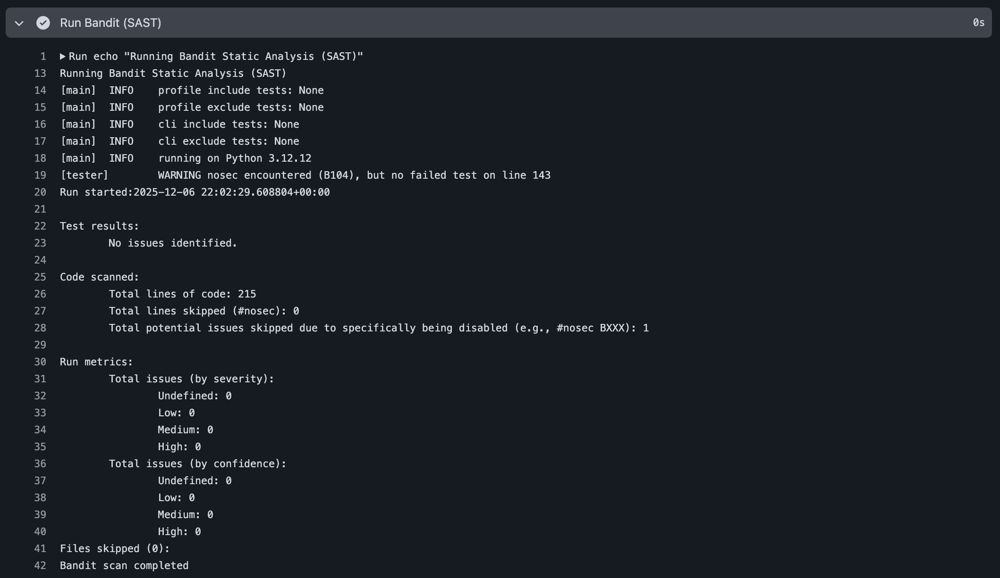
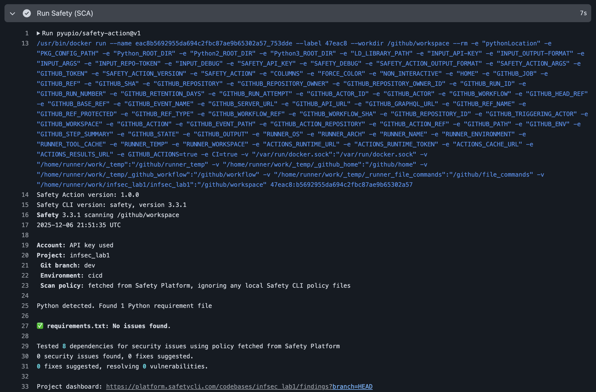

# Защищенное REST API на FastAPI

Лабораторная работа по дисциплине «Информационная безопасность».  
Реализован защищенный REST API с аутентификацией на основе JWT, защитой от основных классов уязвимостей OWASP Top 10 (Injection, XSS, Broken Authentication) и интеграцией автоматизированных проверок безопасности в CI/CD pipeline (GitHub Actions).

## Используемый стек

- Python 3.12+
- FastAPI
- SQLAlchemy 2.0 (ORM)
- SQLite (БД)
- PyJWT + passlib (bcrypt)
- Bandit (SAST), Safety (SCA)

## Доступные эндпоинты

| Метод | Путь                | Описание                                     | Аутентификация |
|-------|---------------------|----------------------------------------------|----------------|
| POST  | `/auth/login`       | Аутентификация пользователя, выдача JWT     | не требуется   |
| GET   | `/api/data`         | Получение списка элементов, принадлежащих текущему пользователю | Bearer JWT     |
| GET   | `/api/users/me`     | Информация о текущем аутентифицированном пользователе | Bearer JWT     |

### Пример входа (POST /auth/login)

```json
{
  "username": "testuser",
  "password": "TestPassword123"
}
```

Успешный ответ:
```json
{
  "access_token": "eyJhbGciOiJIUzI1NiIs...",
  "token_type": "bearer"
}
```

Для доступа к защищенным эндпоинтам передавайте заголовок:
```
Authorization: Bearer <токен>
```

При старте приложения автоматически создается тестовый пользователь `testuser` / `TestPassword123` и один элемент данных, содержащий потенциально опасный XSS-пэйлоад (для демонстрации защиты).

## Реализованные меры защиты

### 1. Защита от SQL-инъекций (A03:2021 – Injection)
- Все запросы к БД выполняются через SQLAlchemy ORM.
- Используются параметризованные запросы, конкатенация строк в SQL-запросах отсутствует.
- Прямое выполнение SQL не используется.

### 2. Защита от XSS (A07:2021 – Cross-Site Scripting)
- Все поля, возвращаемые клиенту (`title`, `description`), проходят обязательную санитизацию через `html.escape()`.
- Реализована функция `sanitize_input()` в `app/dependencies.py`.
- FastAPI дополнительно экранирует выводимые в JSON данные.

### 3. Безопасная аутентификация и управление сессиями (A02:2021 – Cryptographic Failures, A07:2021 – Identification and Authentication Failures)
- Пароли хранятся исключительно в виде bcrypt-хэшей (passlib).
- После успешной аутентификации выдается JWT-токен с временем жизни 30 минут.
- Токен подписывается алгоритмом HS256 с использованием секретного ключа.
- Все защищенные маршруты используют зависимость `get_current_user`, проверяющую валидность и подпись JWT.
- Заголовок `WWW-Authenticate: Bearer` возвращается при ошибках аутентификации.

### 4. Дополнительные меры
- Секретный ключ JWT вынесен в переменную окружения (с значением по умолчанию для локального запуска).
- Автоматическое создание тестовых данных при первом запуске (через `lifespan`).

## Интеграция безопасности в CI/CD (GitHub Actions)

Файл: `.github/workflows/ci.yml`

При каждом `push` и `pull request` автоматически запускаются:

1. **Bandit** – статический анализ кода Python (SAST)
2. **Safety** – проверка зависимостей на известные уязвимости (SCA)

### Отчеты проверок





Все проверки завершаются успешно, критические уязвимости отсутствуют.

## Запуск проекта локально

```bash
pip install -r requirements.txt
python -m app.main
```

API будет доступно по адресу: http://localhost:8000
